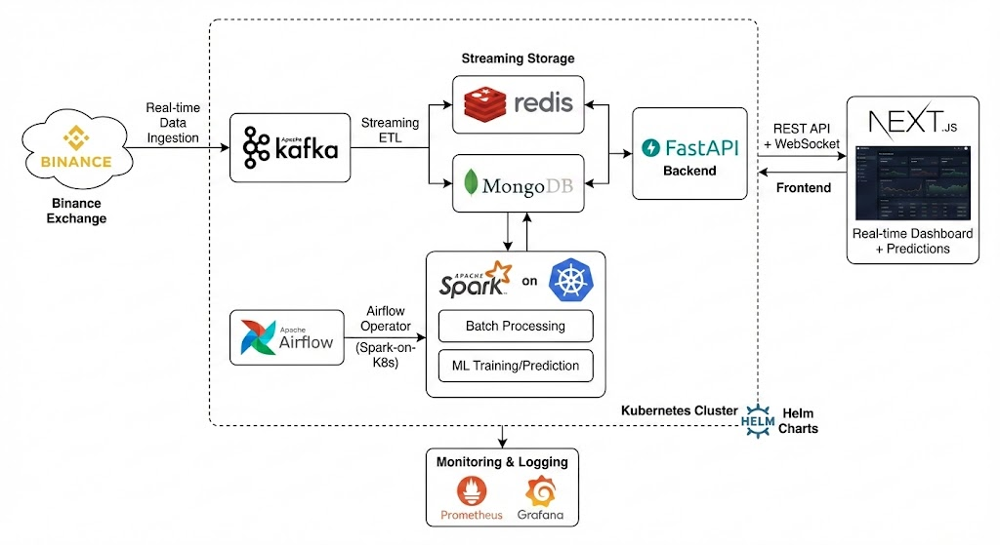
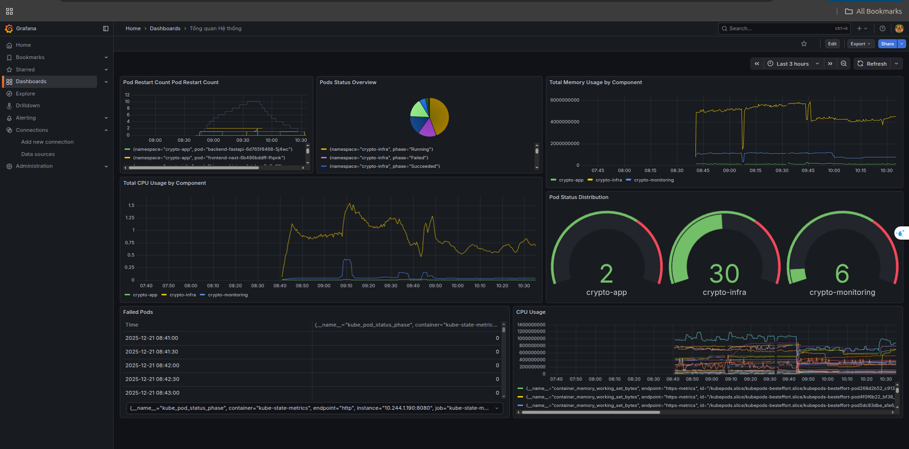
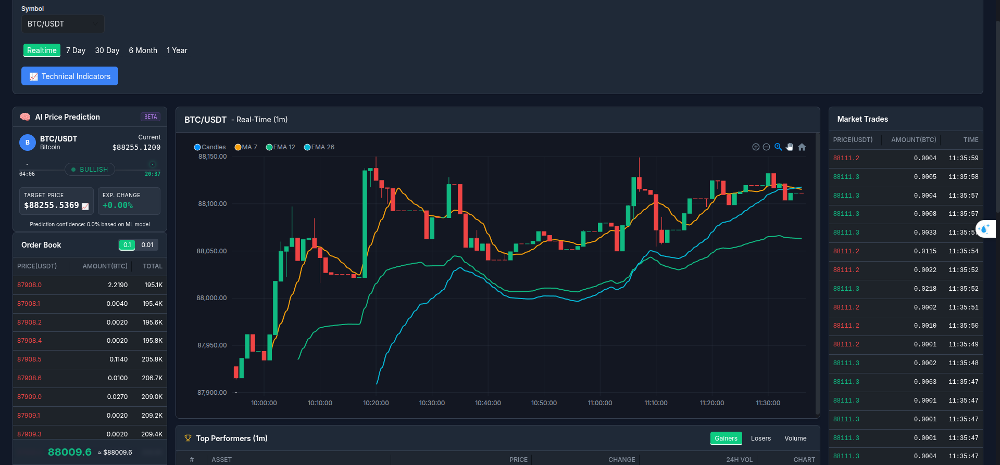
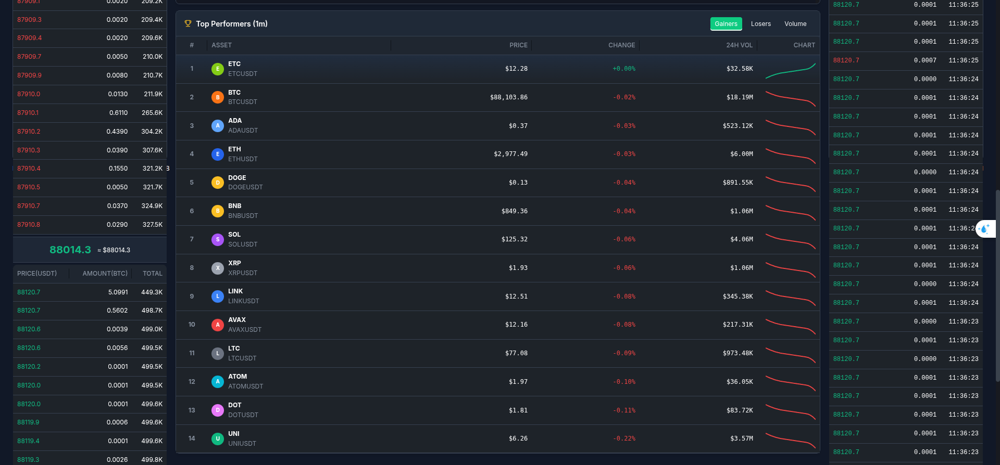

# Hệ Thống Xử Lý Dữ Liệu Cryptocurrency - Real-time Trading Platform

Hệ thống xử lý dữ liệu cryptocurrency toàn diện với khả năng xử lý real-time và batch processing, tích hợp Machine Learning để dự đoán giá và phân tích thị trường.



## 📋 Tổng Quan

Dự án này là một hệ thống end-to-end để thu thập, xử lý, lưu trữ và hiển thị dữ liệu cryptocurrency từ Binance Exchange. Hệ thống hỗ trợ:

- **Real-time Data Streaming**: Thu thập dữ liệu kline, orderbook, và trades từ Binance WebSocket API
- **Batch Processing**: Xử lý và tổng hợp dữ liệu OHLC theo nhiều khung thời gian (5m, 1h, 4h, 1d)
- **Machine Learning**: Dự đoán giá cryptocurrency sử dụng Spark ML
- **Real-time Dashboard**: Giao diện web hiển thị biểu đồ trading, orderbook, và ranking
- **Monitoring & Observability**: Giám sát hệ thống với Prometheus và Grafana

## 🏗️ Kiến Trúc Hệ Thống

### Workflow Tổng Quan


### Các Thành Phần Chính

#### 1. **Data Ingestion Layer**
- **Kafka Producers**: Thu thập dữ liệu real-time từ Binance WebSocket API
  - Kline data (1m interval)
  - Orderbook updates
  - Market trades
- **Kafka Topics**: 
  - `crypto_kline_1m`: Dữ liệu kline 1 phút
  - `crypto_orderbook`: Dữ liệu orderbook
  - `crypto_trades`: Dữ liệu giao dịch

#### 2. **Data Processing Layer**
- **Apache Spark**: 
  - **Batch Processing**: Tổng hợp OHLC data (5m, 1h, 4h, 1d) từ dữ liệu 1m
  - **Streaming Processing**: Xử lý real-time để tính toán ranking và metrics
  - **ML Pipeline**: Training và prediction model cho giá cryptocurrency
- **Apache Airflow**: Orchestration và scheduling cho các Spark jobs

#### 3. **Data Storage Layer**
- **MongoDB**: Lưu trữ dữ liệu lịch sử OHLC đã được tổng hợp
- **Redis**: Cache dữ liệu real-time cho frontend
  - Latest kline data
  - Orderbook snapshots
  - Market trades
  - Ranking data
  - ML predictions

#### 4. **API & Backend Layer**
- **FastAPI**: RESTful API và WebSocket server
  - REST endpoints cho historical data
  - WebSocket streams cho real-time updates
  - ML prediction endpoints

#### 5. **Frontend Layer**
- **Next.js**: Trading dashboard với các tính năng:
  - Real-time candlestick charts
  - Orderbook visualization
  - Market trades feed
  - Coin ranking (top gainers/losers)
  - ML predictions display

#### 6. **Monitoring Layer**
- **Prometheus**: Metrics collection
- **Grafana**: Visualization và alerting

### System Dashboard



## 📁 Cấu Trúc Thư Mục

```
CRYPTO/
├── airflow/                    # Apache Airflow orchestration
│   ├── dags/                   # DAG definitions
│   │   ├── ohlc_spark_aggregator.py
│   │   ├── ml_prediction_dag.py
│   │   └── redis_clear_and_history_fetch_dag.py
│   ├── Dockerfile
│   └── requirements.txt
│
├── backend_fastapi/            # FastAPI backend
│   ├── app/
│   │   ├── main.py             # API endpoints & WebSocket
│   │   ├── config.py           # Configuration
│   │   ├── schemas.py          # Pydantic models
│   │   └── kafka_manager.py    # Kafka consumer manager
│   ├── Dockerfile
│   └── requirements.txt
│
├── frontend/                   # Next.js frontend
│   ├── app/                    # Next.js app directory
│   ├── components/
│   │   ├── charts/             # Trading charts components
│   │   │   ├── TradingDashboard.tsx
│   │   │   └── ChartEmbedded.tsx
│   │   └── ui/                 # UI components
│   ├── Dockerfile
│   └── package.json
│
├── Kafka/                      # Kafka producers
│   ├── binance_producer.py     # Kline data producer
│   ├── binance_orderbook_trades_producer.py
│   ├── redis_consumer.py       # Consumer to Redis
│   └── requirements.txt
│
├── Spark/                      # Apache Spark jobs
│   ├── batch/                  # Batch processing scripts
│   │   ├── ohlc_5m_aggregator.py
│   │   ├── ohlc_1h_aggregator.py
│   │   ├── ohlc_4h_aggregator.py
│   │   ├── ohlc_1d_aggregator.py
│   │   └── train_price_prediction.py
│   ├── ranking_coins/          # Ranking calculation
│   ├── apps/                    # SparkApplication YAMLs
│   └── Dockerfile
│
├── mongodb/                    # MongoDB Helm chart
├── redis/                      # Redis Helm chart
├── Prometheus/                 # Prometheus Helm chart
│
├── deploy/                     # Deployment configurations
│   ├── k8s_web/                # Kubernetes manifests
│   │   ├── frontend-deployment.yaml
│   │   ├── backend-deployment.yaml
│   │   └── ingress.yaml
│   └── helm/                   # Helm deployment scripts
│
└── images/                     # Documentation images
    ├── WorkFlow.png
    ├── Chart.png
    ├── rank.png
    └── SysTemDashBoard.png
```

## 🚀 Tính Năng Chính

### 1. Real-time Data Streaming

Hệ thống thu thập dữ liệu real-time từ Binance:
- **Kline Data**: Dữ liệu nến 1 phút cho 15+ cryptocurrency pairs
- **Orderbook**: Order book depth với updates real-time
- **Market Trades**: Lịch sử giao dịch real-time

### 2. Batch Processing & Aggregation

Spark batch jobs tổng hợp dữ liệu từ 1m interval thành các khung thời gian lớn hơn:
- 5 phút (5m)
- 1 giờ (1h)
- 4 giờ (4h)
- 1 ngày (1d)

### 3. Machine Learning Predictions



Hệ thống ML sử dụng Spark ML Linear Regression để dự đoán:
- Giá cryptocurrency trong 5 phút tiếp theo
- Hướng biến động (tăng/giảm)
- Confidence score

### 4. Coin Ranking System



Tính toán và hiển thị ranking các coin:
- Top Gainers: Coin tăng giá nhiều nhất
- Top Losers: Coin giảm giá nhiều nhất
- Metrics: Percent change, volume, market cap

### 5. Real-time Trading Dashboard

Giao diện web với các tính năng:
- Interactive candlestick charts
- Real-time orderbook visualization
- Market trades feed
- Coin ranking table
- ML predictions display

## 🛠️ Công Nghệ Sử Dụng

### Data Processing
- **Apache Kafka**: Message streaming platform
- **Apache Spark**: Distributed data processing
  - Spark SQL
  - Spark MLlib
  - Spark Structured Streaming
- **Apache Airflow**: Workflow orchestration

### Storage
- **MongoDB**: Document database cho historical data
- **Redis**: In-memory cache cho real-time data

### Backend
- **FastAPI**: High-performance Python web framework
- **WebSocket**: Real-time bidirectional communication
- **Pydantic**: Data validation

### Frontend
- **Next.js**: React framework với SSR
- **TypeScript**: Type-safe JavaScript
- **Chart.js / TradingView**: Charting libraries
- **Tailwind CSS**: Utility-first CSS framework

### Infrastructure
- **Kubernetes**: Container orchestration
- **Docker**: Containerization
- **Helm**: Kubernetes package manager
- **Prometheus**: Metrics monitoring
- **Grafana**: Visualization và alerting

## 📦 Cài Đặt & Triển Khai

### Prerequisites

- Kubernetes cluster (Minikube hoặc cloud K8s)
- kubectl configured
- Helm 3.x
- Docker (cho local development)

### 1. Deploy Infrastructure Components

```bash
# Deploy Kafka (Strimzi Operator)
cd Kafka/strimzi-kafka-operator
kubectl apply -f install/cluster-operator/

# Deploy MongoDB
cd mongodb
helm install mongodb . -n crypto-infra --create-namespace

# Deploy Redis
cd redis
helm install redis . -n crypto-infra

# Deploy Prometheus & Grafana
cd deploy/helm
./deploy-monitoring.sh
```

### 2. Deploy Application Components

```bash
# Deploy Backend API
cd deploy/k8s_web
kubectl apply -f namespace.yaml
kubectl apply -f configmap.yaml
kubectl apply -f secret.yaml
kubectl apply -f backend-deployment.yaml
kubectl apply -f backend-service.yaml

# Deploy Frontend
kubectl apply -f frontend-deployment.yaml
kubectl apply -f frontend-service.yaml

# Deploy Ingress
kubectl apply -f ingress.yaml
```

### 3. Start Data Producers

```bash
# Start Kafka producers
cd Kafka
python binance_producer.py &
python binance_orderbook_trades_producer.py &
python redis_consumer.py &
```

### 4. Start Airflow DAGs

Truy cập Airflow UI và enable các DAGs:
- `ohlc_5m_spark_aggregator`
- `ohlc_1h_spark_aggregator`
- `ohlc_4h_spark_aggregator`
- `ohlc_1d_spark_aggregator`
- `ml_prediction_dag`

## 🔧 Cấu Hình

### Environment Variables

**Backend (FastAPI)**:
```bash
MONGO_URI=mongodb://mongodb:27017
MONGO_DB=CRYPTO
REDIS_HOST=redis
REDIS_PORT=6379
KAFKA_BOOTSTRAP=my-cluster-kafka-bootstrap:9092
```

**Kafka Producers**:
```bash
KAFKA_BROKER=my-cluster-kafka-bootstrap.crypto-infra:9092
KAFKA_TOPIC=crypto_kline_1m
```

### MongoDB Collections

- `5m_kline`: OHLC data 5 phút
- `1h_kline`: OHLC data 1 giờ
- `4h_kline`: OHLC data 4 giờ
- `1d_kline`: OHLC data 1 ngày
- `predictions`: ML prediction results

### Redis Keys

- `crypto:{symbol}:1m:latest`: Latest kline data
- `crypto:{symbol}:1m:{timestamp}`: Historical kline data
- `orderbook:{symbol}:latest`: Orderbook snapshot
- `trades:{symbol}:list`: Market trades list
- `ranking:top_gainers`: Coin ranking data
- `crypto:prediction:{symbol}`: ML predictions

## 📊 API Endpoints

### REST API

- `GET /ohlc`: Lấy dữ liệu OHLC historical từ MongoDB
- `GET /ohlc/realtime`: Lấy dữ liệu OHLC real-time từ Redis
- `GET /latest`: Lấy latest kline data
- `GET /orderbook`: Lấy orderbook snapshot
- `GET /trades`: Lấy market trades
- `GET /ranking/top-gainers`: Lấy coin ranking
- `GET /prediction/{symbol}`: Lấy ML prediction

### WebSocket

- `WS /ws/kline?symbol=BTCUSDT`: Real-time kline stream
- `WS /ws/orderbook?symbol=BTCUSDT`: Real-time orderbook stream
- `WS /ws/trades?symbol=BTCUSDT`: Real-time trades stream

## 🧪 Testing

```bash
# Test Backend API
cd backend_fastapi
python test_api.py

# Test Kafka Producer
cd Kafka
python binance_producer.py

# Test Spark Jobs locally
cd Spark/batch
python ohlc_5m_aggregator.py
```

## 📈 Monitoring

### Prometheus Metrics

- Kafka producer/consumer lag
- Spark job execution time
- API request latency
- Redis memory usage
- MongoDB connection pool

### Grafana Dashboards

Truy cập Grafana tại `http://localhost:3000` để xem:
- System metrics
- Application performance
- Data pipeline health

## 🔍 Troubleshooting

### Kafka không nhận được dữ liệu
- Kiểm tra Kafka broker connectivity
- Verify WebSocket connection to Binance
- Check producer logs

### Spark jobs fail
- Kiểm tra Spark operator logs
- Verify MongoDB connection
- Check resource limits

### Frontend không hiển thị data
- Kiểm tra WebSocket connection
- Verify Redis có dữ liệu
- Check backend API health

## 📝 License

MIT License

## 👥 Contributors

- Development Team

## 🙏 Acknowledgments

- Binance API for market data
- Apache Foundation for open-source tools
- TradingView for charting inspiration

---

**Lưu ý**: Đây là dự án học tập và nghiên cứu. Không sử dụng cho mục đích trading thực tế mà không có proper risk management.

[**⬆️ Back to top**](#hệ-thống-xử-lý-dữ-liệu-cryptocurrency---real-time-trading-platform)
