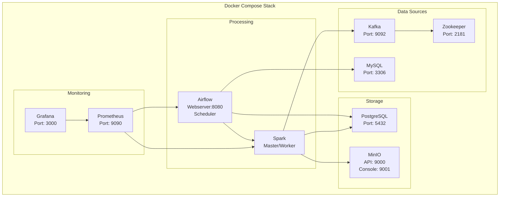
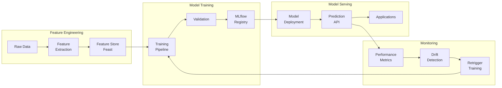
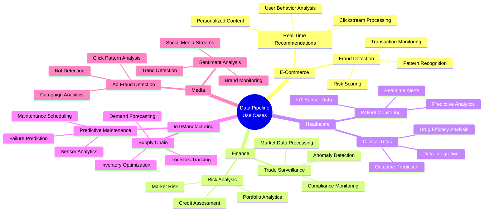

# End-to-End Data Pipeline with Batch & Streaming Processing

This repository contains a **fully integrated, production-ready data pipeline** that supports both **batch** and **streaming** data processing using open-source technologies. It is designed to be easily configured and deployed by any business or individual with minimal modifications.

![pipeline][pipeline.png]

The pipeline incorporates:

- **Data Ingestion:**  
  - **Batch Sources:** SQL databases (MySQL, PostgreSQL), Data Lakes (MinIO as an S3-compatible store), files (CSV, JSON, XML)  
  - **Streaming Sources:** Kafka for event logs, IoT sensor data, and social media streams

- **Data Processing & Transformation:**  
  - **Batch Processing:** Apache Spark for large-scale ETL jobs, integrated with Great Expectations for data quality checks  
  - **Streaming Processing:** Spark Structured Streaming for real-time data processing and anomaly detection

- **Data Storage:**  
  - **Raw Data:** Stored in MinIO (S3-compatible storage)  
  - **Processed Data:** Loaded into PostgreSQL for analytics and reporting

- **Data Quality, Monitoring & Governance:**  
  - **Data Quality:** Great Expectations validates incoming data  
  - **Data Governance:** Apache Atlas / OpenMetadata integration (lineage registration)  
  - **Monitoring & Logging:** Prometheus and Grafana for system monitoring and alerting

- **Data Serving & AI/ML Integration:**  
  - **ML Pipelines:** MLflow for model tracking and feature store integration  
  - **BI & Dashboarding:** Grafana dashboards provide real-time insights

- **CI/CD & Deployment:**  
  - **CI/CD Pipelines:** GitHub Actions or Jenkins for continuous integration and deployment  
  - **Container Orchestration:** Kubernetes with Argo CD for GitOps deployment

### Text-Based Pipeline Diagram

```
                            ┌────────────────────────────────┐
                            │         Batch Source           │
                            │(MySQL, Files, User Interaction)│
                            └────────────────┬───────────────┘
                                             │
                                             │  (Extract/Validate)
                                             ▼
                           ┌─────────────────────────────────────┐
                           │      Airflow Batch DAG              │
                           │ - Extracts data from MySQL          │
                           │ - Validates with Great Expectations │
                           │ - Uploads raw data to MinIO         │
                           └─────────────────┬───────────────────┘
                                             │ (spark-submit)
                                             ▼
                             ┌────────────────────────────────┐
                             │         Spark Batch Job        │
                             │ - Reads raw CSV from MinIO     │
                             │ - Transforms, cleans, enriches │
                             │ - Writes transformed data to   │
                             │   PostgreSQL & MinIO           │
                             └──────────────┬─────────────────┘
                                            │ (Load/Analyze)
                                            ▼
                             ┌────────────────────────────────┐
                             │       Processed Data Store     │
                             │ (PostgreSQL, MongoDB, AWS S3)  │
                             └───────────────┬────────────────┘
                                             │ (Query/Analyze)
                                             ▼
                             ┌────────────────────────────────┐
                             │         Cache & Indexing       │
                             │     (Elasticsearch, Redis)     │
                             └────────────────────────────────┘

Streaming Side:
                              ┌─────────────────────────────┐
                              │       Streaming Source      │
                              │         (Kafka)             │
                              └────────────┬────────────────┘
                                           │
                                           ▼
                           ┌───────────────────────────────────┐
                           │    Spark Streaming Job            │
                           │ - Consumes Kafka messages         │
                           │ - Filters and detects anomalies   │
                           │ - Persists anomalies to           │
                           │   PostgreSQL & MinIO              │
                           └───────────────────────────────────┘

Monitoring & Governance:
                              ┌────────────────────────────────┐
                              │       Monitoring &             │
                              │  Data Governance Layer         │
                              │ - Prometheus & Grafana         │
                              │ - Apache Atlas / OpenMetadata  │
                              └────────────────────────────────┘

ML & Serving:
                              ┌──────────────────────────────┐
                              │        AI/ML Serving         │
                              │ - Feature Store (Feast)      │
                              │ - MLflow Model Tracking      │
                              │ - Model training & serving   │
                              │ - BI Dashboards              │
                              └──────────────────────────────┘

CI/CD & Terraform:
                              ┌──────────────────────────────┐
                              │        CI/CD Pipelines       │
                              │ - GitHub Actions / Jenkins   │
                              │ - Terraform for Cloud Deploy │
                              └──────────────────────────────┘

Container Orchestration:
                              ┌──────────────────────────────┐
                              │       Kubernetes Cluster     │
                              │ - Argo CD for GitOps         │
                              │ - Helm Charts for Deployment │
                              └──────────────────────────────┘
```

### Full Flow Diagram with Backend & Frontend Integration (Optional)

A more detailed flow diagram that includes backend and frontend integration is available in the `assets/` directory. This diagram illustrates how the data pipeline components interact with each other and with external systems, including data sources, storage, processing, visualization, and monitoring. 

Although the frontend & backend integration is not included in this repository (since it's supposed to only contain the pipeline), you can easily integrate it with your existing frontend application or create a new one using popular frameworks like React, Angular, or Vue.js.

<p align="center">
  
</p>

### Docker Services Architecture



### ML Pipeline Flow



## Directory Structure

```
end-to-end-pipeline/
  ├── .devcontainer/                 # VS Code Dev Container settings
  ├── docker-compose.yaml            # Docker orchestration for all services
  ├── docker-compose.ci.yaml         # Docker Compose for CI/CD pipelines
  ├── End_to_End_Data_Pipeline.ipynb # Jupyter notebook for pipeline overview
  ├── requirements.txt               # Python dependencies for scripts
  ├── .gitignore                     # Standard Git ignore file
  ├── README.md                      # Comprehensive documentation (this file)
  ├── airflow/
  │   ├── Dockerfile                 # Custom Airflow image with dependencies
  │   ├── requirements.txt           # Python dependencies for Airflow
  │   └── dags/
  │       ├── batch_ingestion_dag.py # Batch pipeline DAG
  │       └── streaming_monitoring_dag.py  # Streaming monitoring DAG
  ├── spark/
  │   ├── Dockerfile                 # Custom Spark image with Kafka and S3 support
  │   ├── spark_batch_job.py         # Spark batch ETL job
  │   └── spark_streaming_job.py     # Spark streaming job
  ├── kafka/
  │   └── producer.py                # Kafka producer for simulating event streams
  ├── storage/
  │   ├── aws_s3_influxdb.py         # S3-InfluxDB integration stub
  │   ├── hadoop_batch_processing.py  # Hadoop batch processing stub
  │   └── mongodb_streaming.py       # MongoDB streaming integration stub
  ├── great_expectations/
  │   ├── great_expectations.yaml    # GE configuration
  │   └── expectations/
  │       └── raw_data_validation.py # GE suite for data quality
  ├── governance/
  │   └── atlas_stub.py              # Dataset lineage registration with Atlas/OpenMetadata
  ├── monitoring/
  │   ├── monitoring.py              # Python script to set up Prometheus & Grafana
  │   └── prometheus.yml             # Prometheus configuration file
  ├── ml/
  │   ├── feature_store_stub.py      # Feature Store integration stub
  │   └── mlflow_tracking.py         # MLflow model tracking
  ├── kubernetes/
  │   ├── argo-app.yaml              # Argo CD application manifest
  │   └── deployment.yaml            # Kubernetes deployment manifest
  ├── terraform/                     # Terraform scripts for cloud deployment
  └── scripts/
      └── init_db.sql                # SQL script to initialize MySQL and demo data
```

## Components & Technologies

- **Ingestion & Orchestration:**  
  - [Apache Airflow](https://airflow.apache.org/) – Schedules batch and streaming jobs.
  - [Kafka](https://kafka.apache.org/) – Ingests streaming events.
  - [Spark](https://spark.apache.org/) – Processes batch and streaming data.

- **Storage & Processing:**  
  - [MinIO](https://min.io/) – S3-compatible data lake.
  - [PostgreSQL](https://www.postgresql.org/) – Stores transformed and processed data.
  - [Great Expectations](https://greatexpectations.io/) – Enforces data quality.
  - [AWS S3](https://aws.amazon.com/s3/) – Cloud storage integration.
  - [InfluxDB](https://www.influxdata.com/) – Time-series data storage.
  - [MongoDB](https://www.mongodb.com/) – NoSQL database integration.
  - [Hadoop](https://hadoop.apache.org/) – Big data processing integration.

- **Monitoring & Governance:**  
  - [Prometheus](https://prometheus.io/) – Metrics collection.
  - [Grafana](https://grafana.com/) – Dashboard visualization.
  - [Apache Atlas/OpenMetadata](https://atlas.apache.org/) – Data lineage and governance.

- **ML & Data Serving:**  
  - [MLflow](https://mlflow.org/) – Experiment tracking.
  - [Feast](https://feast.dev/) – Feature store for machine learning.
  - [BI Tools](https://grafana.com/) – Real-time dashboards and insights.

## Setup Instructions

### Prerequisites

- **Docker** and **Docker Compose** must be installed.
- Ensure that **Python 3.9+** is installed locally if you want to run scripts outside of Docker.
- Open ports required:  
  - Airflow: 8080  
  - MySQL: 3306  
  - PostgreSQL: 5432  
  - MinIO: 9000 (and console on 9001)  
  - Kafka: 9092  
  - Prometheus: 9090  
  - Grafana: 3000  

### Step-by-Step Guide

1. **Clone the Repository**

   ```bash
   git clone https://github.com/hoangsonww/End-to-End-Data-Pipeline.git
   cd End-to-End-Data-Pipeline
   ```

2. **Start the Pipeline Stack**

   Use Docker Compose to launch all components:
   
   ```bash
   docker-compose up --build
   ```
   
   This command will:
   - Build custom Docker images for Airflow and Spark.
   - Start MySQL, PostgreSQL, Kafka (with Zookeeper), MinIO, Prometheus, Grafana, and Airflow webserver.
   - Initialize the MySQL database with demo data (via `scripts/init_db.sql`).

3. **Access the Services**
   - **Airflow UI:** [http://localhost:8080](http://localhost:8080)  
     Set up connections:  
     - `mysql_default` → Host: `mysql`, DB: `source_db`, User: `user`, Password: `pass`
     - `postgres_default` → Host: `postgres`, DB: `processed_db`, User: `user`, Password: `pass`
   - **MinIO Console:** [http://localhost:9001](http://localhost:9001) (User: `minio`, Password: `minio123`)
   - **Kafka:** Accessible on port `9092`
   - **Prometheus:** [http://localhost:9090](http://localhost:9090)
   - **Grafana:** [http://localhost:3000](http://localhost:3000) (Default login: `admin/admin`)

4. **Run Batch Pipeline**
   - In the Airflow UI, enable the `batch_ingestion_dag` to run the end-to-end batch pipeline.
   - This DAG extracts data from MySQL, validates it, uploads raw data to MinIO, triggers a Spark job for transformation, and loads data into PostgreSQL.

5. **Run Streaming Pipeline**
   - Open a terminal and start the Kafka producer:
     ```bash
     docker-compose exec kafka python /opt/spark_jobs/../kafka/producer.py
     ```
   - In another terminal, run the Spark streaming job:
     ```bash
     docker-compose exec spark spark-submit --master local[2] /opt/spark_jobs/spark_streaming_job.py
     ```
   - The streaming job consumes events from Kafka, performs real-time anomaly detection, and writes results to PostgreSQL and MinIO.

6. **Monitoring & Governance**
   - **Prometheus & Grafana:**  
     Use the `monitoring.py` script (or access Grafana) to view real-time metrics and dashboards.
   - **Data Lineage:**  
     The `governance/atlas_stub.py` script registers lineage between datasets (can be extended for full Apache Atlas integration).

7. **ML & Feature Store**
   - Use `ml/mlflow_tracking.py` to simulate model training and tracking.
   - Use `ml/feature_store_stub.py` to integrate with a feature store like Feast.

8. **CI/CD & Deployment**
    - Use the `docker-compose.ci.yaml` file to set up CI/CD pipelines.
    - Use the `kubernetes/` directory for Kubernetes deployment manifests.
    - Use the `terraform/` directory for cloud deployment scripts.
    - Use the `.github/workflows/` directory for GitHub Actions CI/CD workflows.

### Next Steps

Congratulations! You have successfully set up the end-to-end data pipeline with batch and streaming processing. However, this is a very general pipeline that needs to be customized for your specific use case.

> [!IMPORTANT]
> Note: Be sure to visit the files and scripts in the repository and change the credentials, configurations, and logic to match your environment and use case. Feel free to extend the pipeline with additional components, services, or integrations as needed.

## Configuration & Customization

- **Docker Compose:**  
  All services are defined in `docker-compose.yaml`. Adjust resource limits, environment variables, and service dependencies as needed.

- **Airflow:**  
  Customize DAGs in the `airflow/dags/` directory. Use the provided PythonOperators to integrate custom processing logic.

- **Spark Jobs:**  
  Edit transformation logic in `spark/spark_batch_job.py` and `spark/spark_streaming_job.py` to match your data and processing requirements.

- **Kafka Producer:**  
  Modify `kafka/producer.py` to simulate different types of events or adjust the batch size and frequency using environment variables.

- **Monitoring:**  
  Update `monitoring/monitoring.py` and `prometheus.yml` to scrape additional metrics or customize dashboards. Place Grafana dashboard JSON files in the `monitoring/grafana_dashboards/` directory.

- **Governance & ML:**  
  Replace stub implementations in `governance/atlas_stub.py` and `ml/` with real integrations as needed.

- **CI/CD & Deployment:**  
  Customize CI/CD workflows in `.github/workflows/` and deployment manifests in `kubernetes/` and `terraform/` for your cloud environment.

- **Storage:**

    Data storage options are in the `storage/` directory with AWS S3, InfluxDB, MongoDB, and Hadoop stubs. Replace these with real integrations or credentials as needed.

## Example Applications



### E-Commerce & Retail
- **Real-Time Recommendations:**
  Process clickstream data to generate personalized product recommendations.
- **Fraud Detection:**
  Detect unusual purchasing patterns or multiple high-value transactions in real-time.

### Financial Services & Banking
- **Risk Analysis:**
  Aggregate transaction data to assess customer credit risk.
- **Trade Surveillance:**
  Monitor market data and employee trades for insider trading signals.

### Healthcare & Life Sciences
- **Patient Monitoring:**
  Process sensor data from medical devices to alert healthcare providers of critical conditions.
- **Clinical Trial Analysis:**
  Analyze historical trial data for predictive analytics in treatment outcomes.

### IoT & Manufacturing
- **Predictive Maintenance:**
  Monitor sensor data from machinery to predict failures before they occur.
- **Supply Chain Optimization:**
  Aggregate data across manufacturing processes to optimize production and logistics.

### Media & Social Networks
- **Sentiment Analysis:**
  Analyze social media feeds in real-time to gauge public sentiment on new releases.
- **Ad Fraud Detection:**
  Identify and block fraudulent clicks on digital advertisements.

Feel free to use this pipeline as a starting point for your data processing needs. Extend it with additional components, services, or integrations to build a robust, end-to-end data platform.

## Troubleshooting & Further Considerations

- **Service Not Starting:**  
  Check Docker logs (`docker-compose logs`) to troubleshoot errors with MySQL, Kafka, Airflow, or Spark.
- **Airflow Connection Issues:**  
  Verify that connection settings (host, user, password) in the Airflow UI match those in `docker-compose.yaml`.
- **Data Quality Errors:**  
  Inspect Great Expectations logs in the Airflow DAG runs to adjust expectations and clean data.
- **Resource Constraints:**  
  For production use, consider scaling out services (e.g., running Spark on a dedicated cluster, using managed Kafka).

## Contributing

Contributions, issues, and feature requests are welcome!

1. Fork the Project
2. Create your Feature Branch (`git checkout -b feature/AmazingFeature`)
3. Commit your Changes (`git commit -m 'Add some AmazingFeature'`)
4. Push to the Branch (`git push origin feature/AmazingFeature`)
5. Open a Pull Request
6. We will review your changes and merge them into the main branch upon approval.

## License

This project is licensed under the [MIT License](https://opensource.org/licenses/MIT).

## Final Notes

> [!NOTE]
> This end-to-end data pipeline is designed for rapid deployment and customization. With minor configuration changes, it can be adapted to many business cases—from real-time analytics and fraud detection to predictive maintenance and advanced ML model training. Enjoy building a data-driven future with this pipeline!

---

Thanks for reading! If you found this repository helpful, please star it and share it with others. For questions, feedback, or suggestions, feel free to reach out to me on [GitHub](https://github.com/hoangsonww).

[**⬆️ Back to top**](#end-to-end-data-pipeline-with-batch--streaming-processing)
